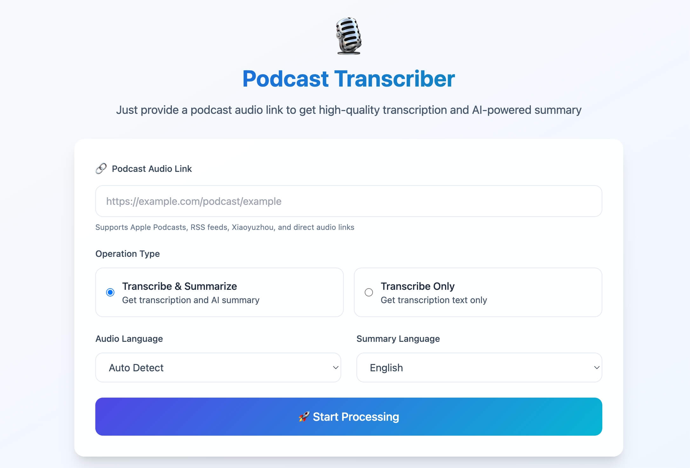

<div align="center">
  
# 🎙️ AI Podcast Transcriber

English | [中文](README_zh.md)

An open-source tool that turns podcasts into high-quality transcripts and AI-powered summaries.



</div>

## 🌟 Project Overview

Podcast Transcriber is a full-stack web application designed to bridge the gap between audio content and text accessibility. It automatically processes podcast episodes from various platforms, and delivers accurate transcriptions with meaningful summaries in multiple languages.

### Key Capabilities

- **🔗 Multi-Platform Support**: Support for Apple Podcasts, Xiaoyuzhoufm, RSS feeds, and direct audio URLs
- **🚀 Performance First**: Using OpenAI Faster-Whisper model for speech-to-text
- **🤖 AI Intelligent Optimization**: AI-optimized transcription and summary text based on podcast content characteristics
- **📱 Responsive Design**: Modern mobile-first UI, friendly experience for both desktop and mobile

## 🏗️ Architecture & Implementation

### System Architecture

```
┌─────────────────┐    ┌──────────────────┐    ┌─────────────────┐
│   Frontend      │    │    Backend       │    │  External APIs  │
│                 │    │                  │    │                 │
│ • HTML5/CSS3    │◄──►│ • Express.js     │◄──►│ • OpenAI GPT    │
│ • Vanilla JS    │    │ • Node.js        │    │ • RSS Feeds     │
│ • TailwindCSS   │    │ • File Download  │    │ • Podcast APIs  │
│ • File Download │    │ • Text Saving    │    │                 │
└─────────────────┘    └──────────────────┘    └─────────────────┘
                              │
                              ▼
                    ┌──────────────────┐
                    │ Local Processing │
                    │                  │
                    │ • Faster-Whisper │
                    │ • Python Script  │
                    │ • Audio Direct   │
                    │ • Text Export    │
                    └──────────────────┘
```

### Core Processing Pipeline

1. **Podcast Link Analysis**: Multi-strategy URL parsing for Apple Podcasts, Xiaoyuzhou, and RSS feeds
2. **Audio Extraction**: Direct download with RSS feed discovery and API integration  
3. **Local Transcription**: High-speed Faster-Whisper processing
4. **Text Optimization**: AI-powered continuity enhancement and flow improvement
5. **Summarization**: Structured content analysis and key point extraction
6. **File Export**: Automatic saving of transcripts and summaries with download links

### Technology Stack

#### Frontend Architecture
- **HTML5**: Semantic markup with accessibility features
- **TailwindCSS**: Utility-first styling with custom design system
- **Vanilla JavaScript**: Lightweight, dependency-free client-side logic
- **Progressive Enhancement**: Graceful degradation for various devices

#### Backend Infrastructure
- **Node.js**: Asynchronous, event-driven server runtime
- **Express.js**: Minimalist web framework with middleware support
- **Python Integration**: Calls Faster-Whisper for local transcription
- **File Management**: Audio download, processing, and result saving

#### AI & ML Integration
- **Faster-Whisper**: Local high-performance speech-to-text transcription
- **GPT-4**: Advanced language model for podcast content summarization and text optimization
- **Custom Prompting**: Specialized prompts optimized for podcasts, enhancing continuity and quality

## 📁 Project Structure

```
podcast-to-text/
├── 📂 public/                          # Frontend Application
│   ├── 📄 index.html                   # Main application interface
│   └── 📄 script.js                    # Client-side logic & UI interactions
│
├── 📂 server/                          # Backend Services
│   ├── 📄 index.js                     # Express server & API routing
│   ├── 📄 whisper_transcribe.py        # Local Faster-Whisper transcription
│   ├── 📂 assets/                      # Test assets
│   │   └── 📄 test_audio.mp3           # Sample audio for testing
│   ├── 📂 services/                    # Core business logic
│   │   ├── 📄 openaiService.js         # AI processing & optimization
│   │   ├── 📄 podcastService.js        # Podcast extraction & parsing
│   │   ├── 📄 audioInfoService.js        # Audio information retrieval
│   │   └── 📄 rssParser.js             # RSS feed processing
│   └── 📂 temp/                        # Temporary audio & text storage (auto-created)
│
├── 📄 package.json                     # Dependencies & scripts
├── 📄 package-lock.json                # Dependency lock file
├── 📄 .env                            # Environment configuration (create from .env.example)
├── 📄 .gitignore                       # Git ignore rules
├── 📄 README.md                        # English documentation
├── 📄 README_zh.md                     # Chinese documentation
├── 📄 PLATFORM_SUPPORT.md             # Platform compatibility guide
├── 📄 start.sh                        # Production start script
├── 📄 quick-start.sh                   # Quick setup script
└── 📄 fix-cursor-terminal.md           # IDE troubleshooting guide
```

## 🚀 Quick Start

### Prerequisites

- **Node.js 16+**: Runtime environment
- **Python 3.8+**: For local Faster-Whisper transcription
- **Faster-Whisper**: Local transcription library (`pip install faster-whisper`)
- **OpenAI API Key**: For transcription text optimization and AI summarization

### Installation

```bash
# Clone the repository
git clone <https://github.com/wendy7756/podcast-transcriber>
cd podcast-to-text

# Install Node.js dependencies
npm install

# Install Python dependencies (local transcription)
pip install faster-whisper

# Configure environment
cp .env.example .env
# Edit .env file, add your OpenAI API key

# Start the application
npm start
# or development mode (auto-reload)
npm run dev

# Access the application
open http://localhost:3000
```

### Configuration

Create a `.env` file with the following variables:

```env
# OpenAI Configuration (for text optimization and summarization only)
OPENAI_API_KEY=your_openai_api_key_here

# Local Whisper Configuration
USE_LOCAL_WHISPER=true
WHISPER_MODEL=base

# Server Configuration
PORT=3000

# Optional: File size limit
MAX_FILE_SIZE=500
```

## 🔧 Advanced Features

### AI Text Optimization

- **Continuity Enhancement**: Seamless connection between transcribed segments
- **Language Preservation**: Maintains original speaker style and expression patterns
- **Filler Word Cleanup**: Intelligent removal of excessive verbal fillers while preserving meaning
- **Structured Summarization**: Hierarchical content organization with key point extraction

### Multi-Platform Support

- **Apple Podcasts**: RSS feed discovery and iTunes API integration
- **Xiaoyuzhoufm**: Native API support with fallback RSS parsing
- **Generic RSS**: Universal podcast feed compatibility
- **Direct Audio**: Support for MP3, M4A, WAV, AAC, and other formats

### Audio Processing
- **Support for Various Duration Podcasts**: Local Faster-Whisper model supports processing audio files of any size
- **Memory Optimization**: Intelligent memory management, suitable for personal devices and workstations
- **Audio Processing Time**: Depends on device performance, network environment, and selected Whisper model


## 🌐 Use Cases

### Personal Users
- **Study Notes**: Convert educational podcasts to text for easy review
- **Content Organization**: Create summary indexes for favorite podcasts
- **Multi-language Learning**: Get transcriptions in different languages for practice

### Professional Users
- **Content Creation**: Use podcast transcriptions for blog and article creation
- **Research Analysis**: Text analysis and citation of academic podcasts
- **Accessibility Support**: Provide text versions for hearing-impaired users

### Enterprise Applications
- **Meeting Records**: Automatic transcription of corporate podcasts and recordings
- **Content Marketing**: SEO optimization of podcast content in text format
- **Knowledge Management**: Integrate audio content into enterprise knowledge bases


## 📄 License

Apache 2.0 License - see [LICENSE](LICENSE) file for details.

## 🤝 Contributing

Contributions are welcome! Please feel free to submit issues, feature requests, or pull requests.

