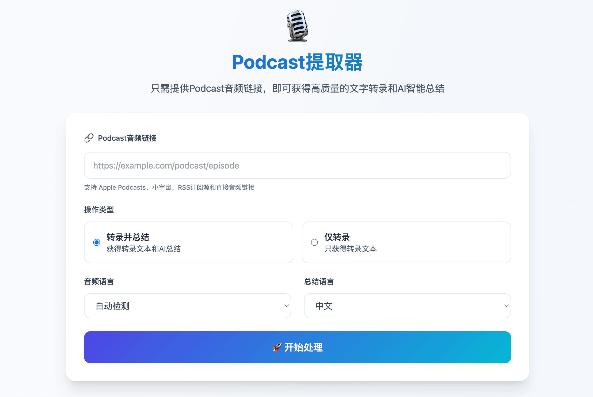

<div align="center">

# 🎙️ AI播客提取器

**中文 | [English](README.md)**

一个开源的高质量AI播客转录和总结工具。



</div>

## 🌟 项目概述

播客提取器是一个将音频内容转化为文本的全栈web应用，自动处理各大平台的播客节目，并以多种语言提供准确的转录和有意义的总结。

### 核心能力

- **🔗 多平台支持**：支持Apple Podcasts、小宇宙、RSS订阅源和直接音频URL
- **🚀 性能优先**：采用openai Faster-Whisper模型语音转文字
- **🤖 AI智能优化**：根据播客内容特点AI优化转录和总结文本
- **📱 响应式设计**：现代化移动优先UI，电脑端和手机端体验友好
- **🌍 条件式翻译**：当所选总结语言与Whisper检测到的语言不一致时，自动调用GPT‑4o生成翻译

## 🏗️ 架构与实现

### 系统架构

```
┌─────────────────┐    ┌──────────────────┐    ┌─────────────────┐
│      前端       │    │      后端        │    │    外部API      │
│                 │    │                  │    │                 │
│ • HTML5/CSS3    │◄──►│ • Express.js     │◄──►│ • OpenAI GPT    │
│ • 原生JS        │    │ • Node.js        │    │ • RSS订阅源     │
│ • TailwindCSS   │    │ • 音频处理管道   │    │                 │
└─────────────────┘    └──────────────────┘    └─────────────────┘
                              │
                              ▼
                    ┌──────────────────┐
                    │   本地音频处理   │
                    │                  │
                    │ • Faster-Whisper │
                    │ • 直接处理       │
                    │ • 无大小限制     │
                    └──────────────────┘
```

### 核心处理流程

1. **播客链接解析**：多策略URL解析，支持不同平台
2. **音频提取**：直接下载结合RSS发现和API集成
3. **本地转录处理**：使用Faster-Whisper模型处理音频文件
4. **文本智能优化**：AI驱动的分段、纠错和流畅度改进
5. **播客内容总结**：结构化内容分析和要点提取

### 技术栈

#### 前端架构
- **HTML5**：语义化标记，具备无障碍功能
- **TailwindCSS**：实用优先的样式系统，自定义设计规范
- **原生JavaScript**：轻量级、无依赖的客户端逻辑
- **渐进式增强**：各种设备的优雅降级

#### 后端基础设施
- **Node.js**：异步、事件驱动的服务器运行时
- **Express.js**：简约的Web框架，支持中间件
- **Python集成**：调用Faster-Whisper进行本地转录
- **文件管理**：音频下载、处理和结果保存

#### AI与机器学习集成
- **Faster-Whisper**：本地高性能语音转文字转录
- **GPT-4**：高级语言模型，用于播客内容总结和文本优化
- **定制提示词**：专门为播客优化的提示词，提升连续性和质量

## 📁 项目结构

```
podcast-to-text/
├── 📂 public/                          # 前端应用
│   ├── 📄 index.html                   # 主应用界面
│   └── 📄 script.js                    # 客户端逻辑和UI交互
│
├── 📂 server/                          # 后端服务
│   ├── 📄 index.js                     # Express服务器和API路由
│   ├── 📄 whisper_transcribe.py        # 本地Faster-Whisper转录脚本
│   ├── 📂 assets/                      # 测试资源
│   │   └── 📄 test_audio.mp3           # 测试音频样本
│   ├── 📂 services/                    # 核心业务逻辑
│   │   ├── 📄 openaiService.js         # AI处理和优化
│   │   ├── 📄 podcastService.js        # 播客提取和解析
│   │   ├── 📄 audioInfoService.js        # 音频信息获取
│   │   └── 📄 rssParser.js             # RSS订阅源处理
│   └── 📂 temp/                        # 临时音频和文本存储（自动创建）
│
├── 📄 package.json                     # 依赖和脚本
├── 📄 package-lock.json                # 依赖锁定文件
├── 📄 .env                            # 环境配置（从.env.example创建）
├── 📄 .gitignore                       # Git忽略规则
├── 📄 README.md                        # 英文文档
├── 📄 README_zh.md                     # 中文文档
├── 📄 PLATFORM_SUPPORT.md             # 平台兼容性指南
├── 📄 start.sh                        # 生产环境启动脚本
├── 📄 quick-start.sh                   # 快速设置脚本
└── 📄 fix-cursor-terminal.md           # IDE故障排除指南
```

## 🚀 快速开始

### 环境要求

- **Node.js 16+**：运行时环境
- **Python 3.8+**：用于本地Faster-Whisper转录（必须创建虚拟环境）
- **ffmpeg**：音频处理库（通常已预装或可通过包管理器安装）
- **OpenAI API密钥**：用于转录文本优化和AI总结

### 安装步骤

```bash
# 克隆仓库
git clone <https://github.com/wendy7756/
podcast-transcriber>
cd podcast-transcriber

# 安装Node.js依赖
npm install

# 创建Python虚拟环境（推荐）
python3 -m venv venv
source venv/bin/activate  # Linux/macOS
# 或 venv\Scripts\activate  # Windows

# 安装Python依赖（本地转录）
pip install --upgrade pip
pip install faster-whisper

# 配置环境
cp .env.example .env
# 编辑.env文件，添加你的OpenAI API密钥

# 启动应用
npm start
# 或开发模式（自动重载）
npm run dev

# 访问应用
open http://localhost:3000
```

### ⚠️ 重要提示

**Python虚拟环境配置**：项目需要在项目根目录下创建名为 `venv` 的Python虚拟环境。这是必需的，因为Node.js服务器会调用 `./venv/bin/python` 来执行转录脚本。

如果您遇到类似 `/bin/sh: .../venv/bin/python: No such file or directory` 的错误，请确保：

1. 在项目根目录下创建了虚拟环境：`python3 -m venv venv`
2. 激活虚拟环境：`source venv/bin/activate`
3. 在虚拟环境中安装了依赖：`pip install faster-whisper`

### 配置说明

创建`.env`文件，包含以下变量：

```env
# OpenAI 配置（仅用于文本优化和总结）
OPENAI_API_KEY=your_openai_api_key_here
# 可选：自定义OpenAI URL（兼容端点）

# 本地Whisper配置
USE_LOCAL_WHISPER=true
WHISPER_MODEL=base

# 服务器配置
PORT=3000

# 可选：音频处理配置
MAX_SEGMENT_SIZE_MB=25
SEGMENT_DURATION_SECONDS=600
```

## 🔧 故障排除

### 常见问题

**Q: 遇到 `No such file or directory: .../venv/bin/python` 错误**

A: 这表示Python虚拟环境未正确创建。请执行以下步骤：

```bash
# 确保在项目根目录
cd /path/to/podcast-transcriber

# 删除可能存在的错误虚拟环境
rm -rf venv

# 重新创建虚拟环境
python3 -m venv venv

# 激活虚拟环境
source venv/bin/activate

# 确认Python路径
which python  # 应该显示 .../venv/bin/python

# 安装依赖
pip install --upgrade pip
pip install faster-whisper

# 重启服务器
npm start
```

**Q: 转录功能无响应或报错**

A: 确保：
1. 虚拟环境已正确创建和激活
2. `faster-whisper` 已在虚拟环境中安装
3. 系统有足够的内存（建议至少4GB可用内存）
4. ffmpeg已安装（`which ffmpeg` 检查）

**Q: 500 内部服务器错误**

多数 500 报错并非网络问题，而是本地 Python 虚拟环境未正确创建或依赖缺失导致。判断原则：如果播客链接能在浏览器直接打开，基本可排除网络问题。

快速排查步骤：

```bash
# 1) 确认在项目根目录
cd /path/to/podcast-transcriber

# 2) 重新创建虚拟环境
rm -rf venv
python3 -m venv venv
source venv/bin/activate

# 3) 安装依赖
pip install --upgrade pip
pip install faster-whisper

# 4) 验证python路径与ffmpeg
which python     # 应显示 .../podcast-transcriber/venv/bin/python
which ffmpeg     # 应有可执行路径

# 5) 重启服务器
npm start
```

若问题依旧，请查看终端日志的详细错误堆栈并附带日志提Issue。

**Q: 首次转录速度很慢**

A: 这是正常现象。Faster-Whisper首次运行时需要下载模型文件（约75MB），后续转录会明显加快。

## 🔧 高级特性

### AI文本优化

- **连续性增强**：转录片段间的无缝连接
- **语言保持**：保持原说话者的风格和表达模式
- **语气词清理**：智能移除多余的语气词，同时保留语义
- **结构化总结**：分层内容组织，关键点提取

### 多平台支持

- **Apple Podcasts**：RSS订阅源发现和iTunes API集成
- **小宇宙**：原生API支持，RSS解析备用
- **通用RSS**：通用播客订阅源兼容性
- **直接音频**：支持MP3、M4A、WAV、AAC等格式

### 音频处理
- **支持各种时长播客**：本地Faster-Whisper模型支持处理任意大小的音频文件
- **内存优化**：智能内存管理，适用于个人设备和工作站
- **音频处理时间**：取决于设备性能、网络环境和选择的Whisper模型


## 🌐 使用场景

### 个人用户
- **学习笔记**：将教育播客转为文字便于复习
- **内容整理**：为收藏的播客创建摘要索引
- **多语言学习**：获取不同语言的转录练习

### 专业用户
- **内容创作**：播客转录用于博客和文章创作
- **研究分析**：学术播客的文本分析和引用
- **无障碍支持**：为听力障碍用户提供文字版本

### 企业应用
- **会议记录**：企业播客和录音的自动转录
- **内容营销**：播客内容的文字版本SEO优化
- **知识管理**：将音频内容整合到企业知识库


## 📄 许可证

Apache 2.0许可证 - 详见[LICENSE](LICENSE)文件。

## 🤝 参与贡献

欢迎贡献代码！请随时提交问题、功能请求或PR。

